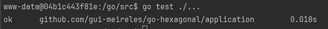

# Arquitetura hexagonal

---

### Como subir o projeto:

Abra um terminal na **pasta raiz**, e logo em seguida digite: `docker-compose up -d`.

Para checar se o docker está de pé, rode o comando: `docker ps`.

Acesse o bash com: `docker exec -it appproduct bash`.

### Para evitar bugs de versionamento:

Tenha preferência por utilizar as **mesmas versões do arquivo** `go.mod` existente, **copie** todos os `require`,
apague o arquivo `go.mod` existente e cole no arquivo `go.mod` que você criará logo abaixo:

Vamos criar um arquivo **go.mod** dentro do bash com o comando: `go mod init github.com/gui-meireles/go-hexagonal`, para facilitar
o download dos pacotes que vamos trabalhar.

---

Vamos utilizar a pasta `application` para definir o **coração da nossa aplicação**, que ficará isolada do mundo externo.

De primeiro momento, vamos definir uma interface de **product**, siga como está em `application/product.go`.

E para testar os métodos de product, utilizaremos o arquivo: `product_test.go`.

Para rodá-lo, utilize o comando: `go test ./...` dentro do bash do container.
